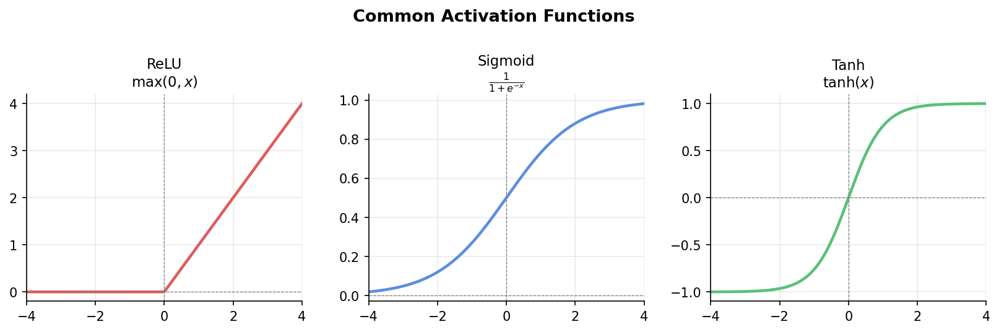

# A Dialectical Introduction to Deep Learning


### 1. What is the simplest deep learning model?

A **Multi-Layer Perceptron (MLP)** — a sequence of layers stacked together:

```
Input Layer → Hidden Layer(s) → Output Layer
```

Each layer transforms the signal from the previous one. The "deep" in deep learning simply means there are multiple hidden layers.

---

### 2. What happens inside each layer? 

Each neuron computes:

$$\mathbf{y} = \sigma(\mathbf{W}\mathbf{x} + \mathbf{b})$$

- **W** (weight matrix): what the layer pays attention to
- **b** (bias): shifts the output
- **σ** (activation function): the nonlinearity

<details>
<summary><b>Why not just stack linear layers — why do we need the activation function?</b></summary>

A composition of linear transformations is still just a linear transformation. No matter how many layers you add, the whole network collapses into a single matrix multiplication. Activation functions introduce nonlinearity, which is what gives deep networks their expressive power.

</details>

<details>
<summary><b>Common activation functions</b></summary>



| Function | Formula | Output Range | Typical Use |
|----------|---------|--------------|-------------|
| **ReLU** | $\max(0, x)$ | $[0, \infty)$ | Hidden layers — fast, default choice |
| **Sigmoid** | $\frac{1}{1+e^{-x}}$ | $(0, 1)$ | Binary output — squashes to probability |
| **Tanh** | $\tanh(x)$ | $(-1, 1)$ | Zero-centered alternative to Sigmoid |
| **Softmax** | $\frac{e^{x_i}}{\sum e^{x_j}}$ | $(0,1)$, sums to 1 | Multi-class output — converts logits to probabilities |

ReLU dominates hidden layers today — it's simple and avoids the vanishing gradient problem that plagued Sigmoid and Tanh in deep networks.

</details>

<details>
<summary><b>Why Softmax? The intuition behind the exponential</b></summary>

Say a language model scores three candidate next words: `["cat": 2.0, "dog": 1.5, "car": 0.5]`. These are raw logits — not yet probabilities.

A naive normalization (divide by sum) would give soft, close probabilities. But we want the model to commit — the highest-scoring word should win decisively.

The exponential amplifies differences. A small gap in scores becomes a large gap in probabilities:

$$e^{2.0} \approx 7.4, \quad e^{1.5} \approx 4.5, \quad e^{0.5} \approx 1.6$$

After dividing by the sum, "cat" gets ~55% instead of ~44% from naive normalization. The winner pulls further ahead.

Think of it like squaring in MSE — squaring punishes large errors disproportionately; exponentiation rewards high scores disproportionately. Both use nonlinearity to sharpen the signal.

</details>


---

### 3. Now we have a model. How does it learn?

Like any supervised model (e.g. linear regression), we define a **loss function** that measures how wrong the predictions are. The goal is to minimize it by adjusting **W** and **b**.

The challenge: with many layers, how do we know how much each weight contributed to the error?

**Backpropagation** solves this — it applies the chain rule of calculus to propagate gradients from the output back through each layer, giving us the gradient of the loss with respect to every weight.

**Gradient descent** then uses those gradients to update the weights:

$$\mathbf{W} \leftarrow \mathbf{W} - \eta \cdot \nabla_{\mathbf{W}} \mathcal{L}$$

Optimizers like **SGD** and **Adam** are strategies for doing this update more efficiently (e.g. using momentum, adaptive learning rates).

> Backpropagation computes the gradients. Gradient descent uses them. They are distinct steps.

<details>
<summary><b>How much data do we use per update? Three gradient descent strategies</b></summary>

| Strategy | Data per update | Gradient quality | Behavior |
|----------|----------------|-----------------|----------|
| **Batch GD** | Full dataset | Exact, smooth | Slow — one update per epoch |
| **SGD** | 1 sample | Noisy | Fast updates, but unstable |
| **Mini-Batch GD** | Small batch (e.g. 32, 128) | Good approximation | Best of both |

In practice, **mini-batch is the default**. When deep learning frameworks refer to `SGD` (e.g. `torch.optim.SGD`), they almost always mean mini-batch — the name is used loosely. (In practice, almost everyone uses mini-batch + Adam. )

The noise in SGD isn't purely a downside — it can help escape shallow local minima that batch GD gets stuck in.


</details>


---

### 4. bias-variance tradeoff

This is the **bias-variance tradeoff** — a too-simple model underfits, a too-complex one memorizes noise.

Common regularization techniques in deep learning:

- **Dropout**: randomly zeros out neurons during training, preventing co-adaptation
- **Batch Normalization**: normalizes activations within a mini-batch, stabilizing training and acting as mild regularization
- **Weight Decay (L2)**: penalizes large weights, keeping the model from over-relying on any one feature
- **Early Stopping**: halt training when validation loss stops improving

These don't change the model architecture — they shape how it learns, nudging it toward solutions that generalize.
